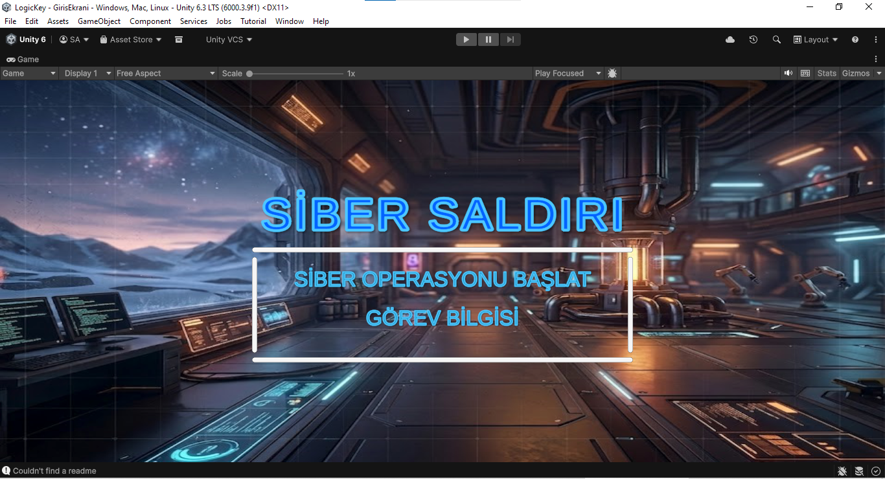
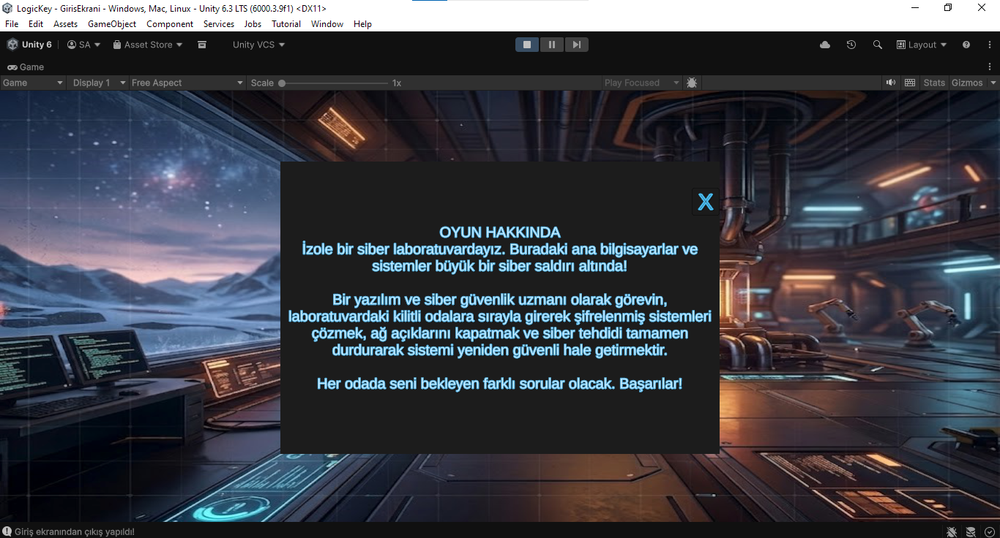
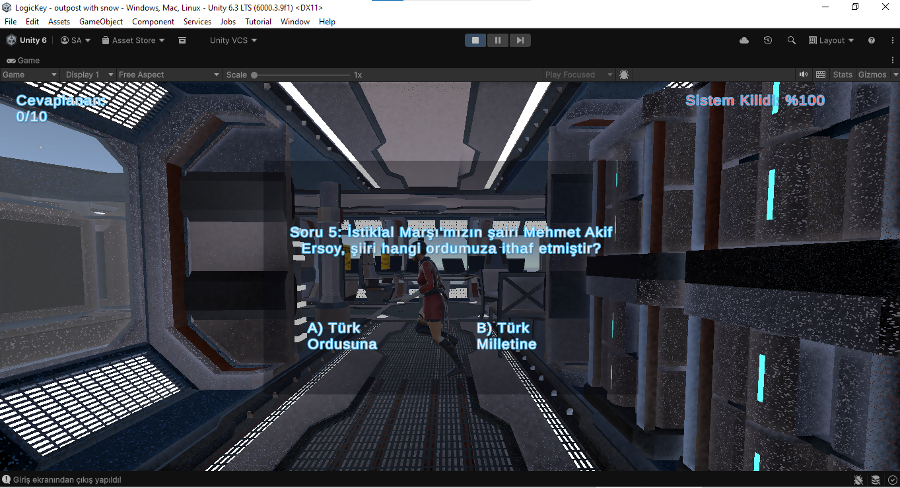

# Cyber Attack: 3D Quiz Game

An interactive 3D quiz game built in Unity. Players enter a cyber-attack scenario, review the mission briefing, and answer questions while progressing through a sci-fi environment.

## Highlights

- Narrative-driven cyber-security scenario and mission briefing flow
- 3D sci-fi environment with in-game UI
- Multiple-choice quiz interactions and progress tracking
- Turkish player-facing interface

## Built With

- Unity `6000.3.9f1` (Unity 6.3 LTS)
- Universal Render Pipeline (URP)
- Unity Input System and Cinemachine

## Run Locally

1. Install Unity Hub and Unity `6000.3.9f1`.
2. Clone this repository.
3. Open the repository root from Unity Hub.
4. Let Unity regenerate the `Library` cache, then press **Play**.

## Screenshots

| Start screen | Mission briefing |
| --- | --- |
|  |  |

### Quiz gameplay

## Verification

The project was opened and played successfully in Unity `6000.3.9f1` on Windows in September 2026.

## Repository Notes

Unity-generated cache folders such as `Library`, `Temp`, and `Logs` are intentionally excluded. The source project, assets, packages, and project settings are versioned.
